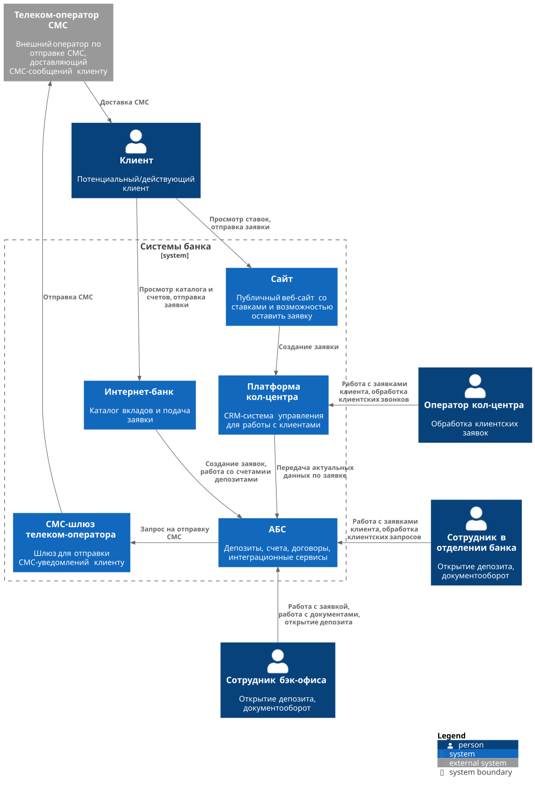
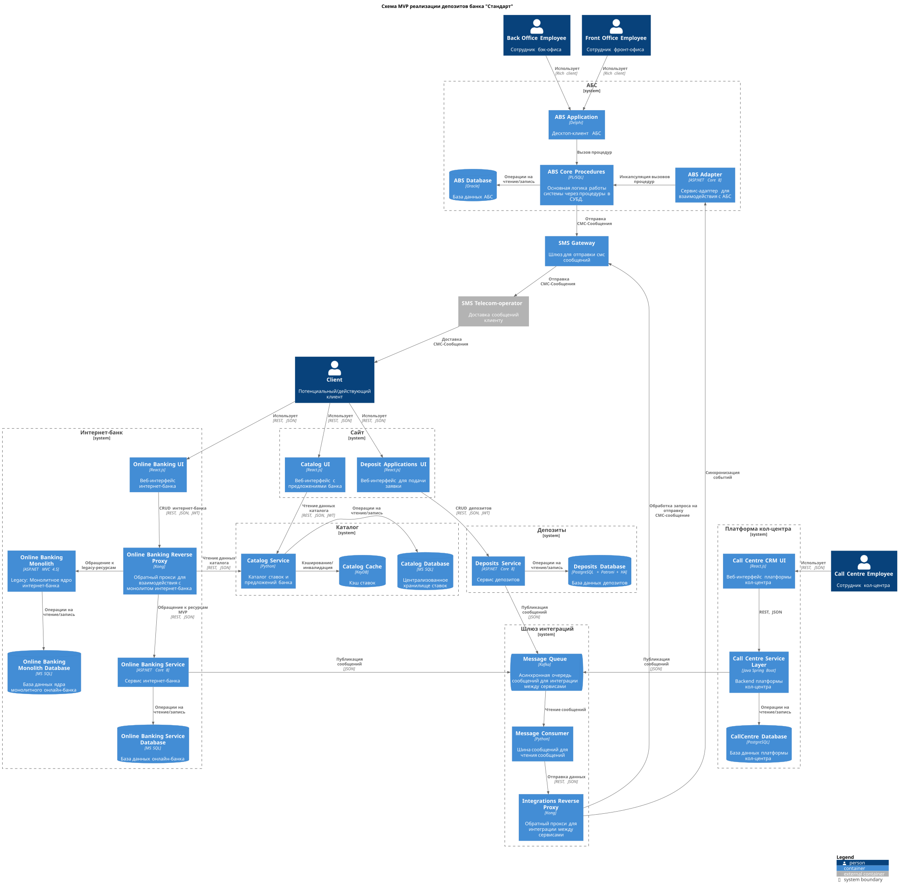

### **Название задачи: 001. Схема концептуальной архитектуры открытия депозитов для MVP.** 
### **Автор: github.com/santechniqueue**
### **Дата: 31.10.2025**
### **Функциональные требования**

| **№** | **Действующие лица или системы**          | **Use Case**                                                        | **Описание**                                                                                                                                                                                    |
|:-----:|:------------------------------------------|:--------------------------------------------------------------------|:------------------------------------------------------------------------------------------------------------------------------------------------------------------------------------------------|
|  UC1  | Клиент > Сайт                             | Просматривать каталог депозитов                                     | Клиент видит актуальные ставки и условия                                                                                                                                                        |
|  UC2  | Клиент > Сайт > Кол-центр                 | Подать заявку на депозит с сайта                                    | Клиент оставляет ФИО и телефон > Заявка отправляется в платформу кол-центра > оператор перезванивает                                                                                            |  
|  UC3  | Клиент > Интернет-банк                    | Просматривать персонализированные ставки                            | Авторизованный клиент видит персонализированные ставки                                                                                                                                          |
|  UC4  | Клиент > Интернет-банк > Интеграции       | Подать заявку на депозит из интернет-банка                          | Клиент выбирает счёт и сумму, отправляет заявку и подтверждает её СМС‑кодом                                                                                                                     |
|  UC5  | Система > Клиент                          | Отправлять уведомление по статусу заявки                            | Отправка СМС оповещений клиенту о статусах его заявок                                                                                                                                           |
|  UC6  | Клиент > Сайт                             | Подать заявку на кредит с сайта                                     | Клиент может подать заявку на открытие кредита с сайта                                                                                                                                          |     
|  UC7  | Клиент > Сайт, интернет-банк              | Просматривать список доступных кредитов на сайте и в интернет-банке | Клиенту должны отображаться доступные ему кредиты на сайте и в интернет банке                                                                                                                   |
|  UC8  | Клиент > Сайт                             | Предварительно принимать решение о выдаче кредита                   | Клиент оставляет паспортные данные > Кредитный рейтинг сверяется с БКИ > принимается предварительное решение о выдаче кредита                                                                   |
|  UC9  | Клиент > Интернет-банк                    | Подать ускоренную заявку на предодобренный кредит                   | Клиенту должны отображаться предодобренные кредиты в интернет-банке. Сама подача заявки - с СМС‑подтверждением и ускоренная обработка.                                                          |
| UC10  | Бэк-офис > АБС                            | Обработка/открытие депозита                                         | В MVP открытие выполняет бэк‑офис в АБС, статусы синхронизируются в каналы                                                                                                                      |
| UC11  | Клиент > Сайт > Сотрудник отделения > АБС | Поддерживать единый контур заявок на кредит                         | Клиент может оформить заявку на кредит в отделении банка, но эта же заявка может быть создана им и на сайте. В таком случае, сотрудник банка должен продолжить работать с той же самой заявкой. |
### **Нефункциональные требования**

| **№** | **Требование**                                                                                                                                    |
|:-----:|:--------------------------------------------------------------------------------------------------------------------------------------------------|
|   1   | Доступность 24/7 SLA 99,9% для нового контура, резервирование между ЦОД, авто-фейловер.                                                           |
|   2   | Интеграции с АБС через anti-corruption layer: никаких прямых запросов к БД АБС.                                                                   |
|   3   | Асинхронность и очереди Kafka для разгрузки АБС и надёжности; идемпотентность запросов, ретраи.                                                   |
|   4   | Обновление ставок <= 5 мин после изменения, версионирование ставок.                                                                               |
|   5   | Безопасность ПДн: Передача данных должна происходить с использованием TLS 1.2+, шифрования, маскирования логов, хранение данных на территории РФ. |
|   6   | Совместимость с текущим стеком: Интернет-банк - .NET Framework 4.5 монолит, интеграции - через внешние сервисы/шлюз.                              |
|   7   | Наблюдаемость: логи, метрики, APM, распределённый трейсинг.                                                                                       |
|   8   | Высокая пропускная способность >= 100 RPS, горизонтальная масштабируемость.                                                                       |
|   9   | Бизнес-операции должны проводиться мгновенно < 500 мс                                                                                             |
|  10   | Использовать уже имеющийся стек: MS SQL/Oracle; .NET/Java/Python; Kafka. Для интернет-банка (ASP.NET MVC 4.5).                                    |
|  11   | CI/CD, blue‑green/канареечные релизы, фича‑флаги; минимальный набор автотестов для новых сервисов (юнит/контракт/интеграционные).                 |
|  12   | Отказоустойчивость: при выходе из строя одного из узлов взаимодействия - остальные узлы, работающие с ним продолжают работу.                      |
### **Решение**

[Диаграмма контекста](C4_Context.puml)

[Диаграмма контейнеров](C4_Containers.puml)

1. UI сайта и интернет-банка - React.js: 
Одинаковый фронтовый стек ускоряет delivery и унифицирует UX (U). 
Через Kong выполняем Strangler-Fig: часть роутов идёт в легаси-монолит, часть - в новые сервисы (S/R).
2. Каталог - Python + MS SQL мастер + KeyDB кэш:  
MS SQL - единое хранилище ставок (S) и соответствует корпоративному стеку, KeyDB - быстрые чтения (U/P). 
Python хорош для MVP и легкого горизонтального масштабирования, есть сотрудники с опытом в Python разработке (кредитный скоринг).  
Кэш прокрывает <200 мс p50 чтения на чтениях и SLA публикации ставок (U/P).
3. Интернет-банк - MVP на ASP.NET Core 8 + Kong + монолит на .NET 4.5:  
MVP-сервис рядом с монолитом позволяет постепенно выносить функционал в новый стек, сохраняя совместимость (S) и снижая риски релизов, так как роуты можно откатывать на монолит(R).
4. Депозиты - ASP.NET Core 8 + PostgreSQL с Patroni и HA: 
Логика заявок и статусов отделена от каталога. PostgreSQL даёт транзакционность, а отказоустойчивость достигается за счёт Patroni (R).
5. Интеграции - Kafka + Python-consumer + Kong: 
Kafka как единая шина событий и отделение узлов от АБС (R), consumer - оркестрация и конверсия сообщений и вызовы в интеграционный прокси Kong (S).
6. АБС - ABS Adapter на ASP.NET Core 8 + PL/SQL: 
Anti-corruption layer изолирует схемы/процедуры АБС (S), место для идемпотентности и ретраев к процедурам, чтобы фронтовые сервисы были простыми и устойчивыми (R).

### **Альтернативы**
1. Оставить решение на монолите, расширяем текущий ASP.NET MVC 4.5 + ABS: 
Не вводить отдельные сервисы и доработать монолит интернет-банка и интеграции с ABS. 
Плюсы: минимальные интеграционные риски; быстрее старт, меньше DevOps-нагрузки; одна БД (MS SQL). 
Минусы: слабая масштабируемость, высокая связность; труднее обеспечить SLA/наблюдаемость; откат к единой точке отказа. 
Когда выбирать: очень жёсткие сроки и бюджет, низкая ожидаемая нагрузка, нет цели на последующую декомпозицию.
2. Полная переход на .NET Core 8 + MS SQL: 
Catalog, Deposits, ABS Adapter реализовать на ASP.NET Core 8 с единым MS SQL в качестве СУБД, KeyDB/Redis как кэш оставить. 
Плюсы: единый рантайм, язык и ORM; меньше операционной сложности; проще поддержка и онбординг; хорошая интеграция с существующим MSSQL-ландшафтом. 
Минусы: потеря гибкости стека; возможен технический долг, из-за сильной загрузки .NET-команды. 
Когда выбирать: сильная .NET-команда, требования к унификации платформы и снижению TCO. 
3. RabbitMQ вместо Kafka: 
Для команд и гарантированных доставок с низкой пропускной способностью - брокер сообщений (AMQP). 
Плюсы: проще операционно; удобен для RPC или команд; предсказуемые подтверждения. 
Минусы: хуже для стриминга и хранения истории событий; менее удобная реабилитация или повторы по истории.
Когда выбирать: поток событий невелик, нужен простой брокер.
4. Единый контур SMS через интеграции (без прямых вызовов из ABS): 
Оставить только IntegrationReverseProxy > SMSGateway, а ABS публикует событие.
Плюсы: единые шаблоны, аудит и идемпотентность; меньше дублей и коллизий.
Минусы: дополнительная задержка; зависимость от интеграционного контура SMS.
Когда выбирать: если есть запас на доработку в АБС.
5. Прямые вызовы АБС, без ABS Adapter: 
Сервисы ходят в процедуры АБС напрямую. 
Плюсы: быстрее старт MVP.
Минусы: хрупкость при изменениях АБС, сложность тестов и откатов; нарушение anti-corruption.
Когда выбирать: только как временный спайк с быстрым результатом.

**Недостатки, ограничения, риски**

1. Расщепление логики между монолитом и новыми сервисами: 
Риск: дублирование бизнес-правил, расхождение статусов.
Исправление: Strangler-план по маршрутам, единые доменные соглашения в ABS Adapter/Deposits.
2. Kong и Kafka как критические точки: 
Риск: misconfig, падение - деградация каналов. 
Исправление: HA, readiness/liveness; для Kafka - мониторинг лагов.
3. Среда интернет-банка и ABS слабо изолированы: 
Риск: нестабильные интеграционные тесты. 
Исправление: контракты (Pact/REST-контракты), sandbox-эмуляторы, фиксация тестовых данных.
4. Мульти-стек .NET/Python: 
Риск: «узкие места» на экспертизе, рост сложности поддержки. 
Исправление: команда под платформы. 
