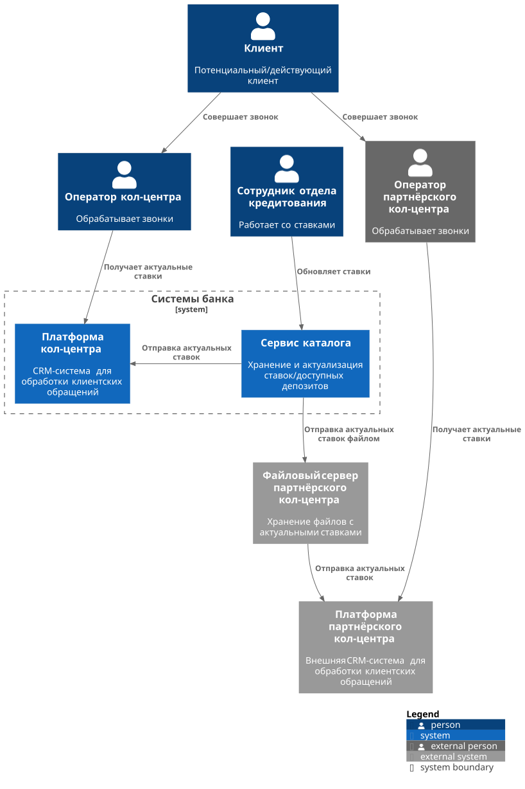
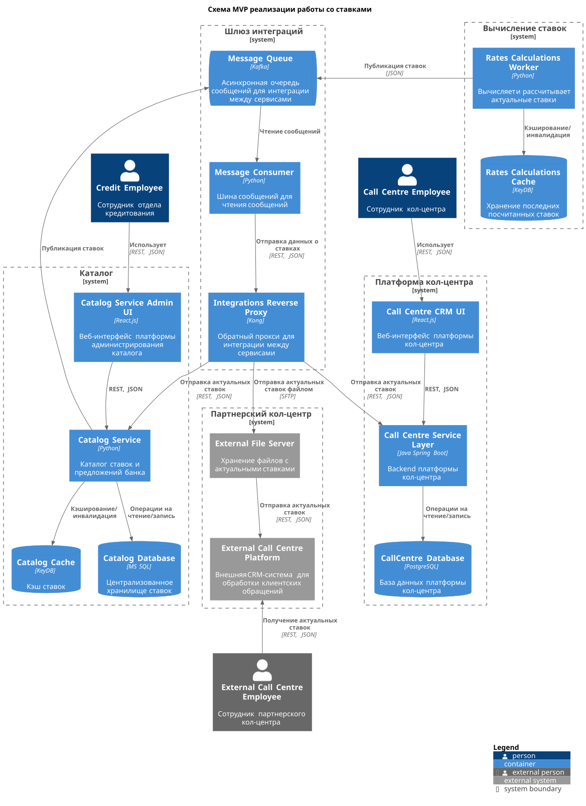

### **Название задачи: 001. MVP открытия депозитов в банке "Стандарт".**
### **Автор: github.com/santechniqueue**
### **Дата: 03.11.2025**

### **Функциональные требования**

| **№** | **Действующие лица или системы** | **Use Case**                                          | **Описание**                                                                                                                                                          |
|:-----:|:---------------------------------|:------------------------------------------------------|:----------------------------------------------------------------------------------------------------------------------------------------------------------------------|
|  F1   | Оператор кол-центра              | Просматривать актуальные ставки в CRM                 | Сотрудник кол-центра должен иметь возможность просмотра актуальных ставок в CRM.                                                                                      |
|  F2   | Оператор партнёрского кол-центра | Просматривать актуальные ставки банка в своей системе | Сотрудник партнерского кол-центра так же должен иметь возможность просмотра актуальных ставок в своей системе.                                                        |  
|  F3   | Система                          | Автоматически обновлять ставки в системе              | Система должна автоматически высчитывать и обновлять ставку на основе ставки рефинансирования ЦентробанкаЮ текущего количество выданных кредитов и депозитов в банке. |
|  F4   | Система                          | Экспорт ставок после обновления                       | Распространять актуальные ставки для всех систем.                                                                                                                     |
|  F5   | Сотрудник отдела кредитования    | Вручную обновлять ставки в системе                    | В экстренном случае допускается ручная правка ставок уполномоченным сотрудником вместо XLS‑файла.                                                                     |
|  F6   | Система                          | Импорт ставок в CRM                                   | После обновления ставок - считывать информацию о новых ставках и загружать их в CRM.                                                                                  |
|  F7   | Система                          | Импорт ставок в партнерскую систему кол-центра        | После обновления ставок - считывать информацию о новых ставках и отправлять их файлом партнерскому кол-центру.                                                        |

### **Нефункциональные требования**

| **№** | **Требование**                                                                                                                    |
|:-----:|:----------------------------------------------------------------------------------------------------------------------------------|
|  NF1  | Мгновенная актуализация ставок во внутреннем кол-центр - задержка <= 1 сек с момента обновления ставок.                           |
|  NF2  | Мгновенная отправка ставок партнерскому кол-центру - задержка <= 1 сек с момента обновления ставок.                               |
|  NF3  | Формат файлов: CSV, UTF‑8, разделитель.                                                                                           |
|  NF4  | Обмен файлами с партнёрским КЦ - по SFTP протоколу.                                                                               |
|  NF5  | Ретрай отправки, протоколирование всех операций.                                                                                  |
|  NF6  | Совместимость со стеком MVP: Catalog (Python + MS SQL + KeyDB), Integrations (Kong).                                              |
|  NF7  | Горизонтальное масштабирование, импорт в КЦ проводится пакетами, rate‑limit на Catalog API.                                       |

### **Решение**

[Диаграмма контекста](C4_Context.puml)

[Диаграмма контейнеров](C4_Containers.puml)

### **Альтернативы**
1. Получение ставок по расписанию: 
Получать платформами из Catalog API ставки по расписанию. 
Плюсы: простая реализация; нет входящих вызовов в КЦ. 
Минусы: не выполняет NF1 (≤1 c); окна устаревших данных; пики нагрузки на Catalog. 
Когда выбирать: временный фолбэк, ночные окна, низкая критичность актуальности.
2. Email вместо SFTP: 
Отправлять файл с актуальными ставками партнёру не через SFTP, а по Email
Плюсы: быстрый старт; инфраструктура уже есть. 
Минусы: слабый контроль и ACK; спам-фильтры; неудобная автоматизация. 
Когда выбирать: только как временный канал на пилоте или при авариях SFTP. 
3. Чтение из кэша напрямую: 
Все сервисы внутри контура читают общий кэш (KeyDB) напрямую.  
Плюсы: минимальная задержка; исключает импорты/БД КЦ. 
Минусы: слабая автономность CRM; нет истории; зависимость от кэша. 
Когда использовать: малонагруженные сценарии без требований к истории и оффлайну. 

**Недостатки, ограничения, риски**

1. Зависимость от SFTP партнёра: 
Риск: недоступность и узкие окна > задержка доставки файлов.
Исправление: ретраи с backoff, очереди задач, мониторинг доступности, альтернативный канал (email).

### Крупные задачи
T1: [ASP.NET] Online banking MVP back-end - разработка back-end MVP интернет-банка
T2: [Python] Catalog back-end - разработка back-end сервиса каталога
T3: [DevOps] Kafka - развёртывание Kafka для интеграций
T4: [Java] Message Bus - сообщений и синхронизация заявок в платформу кол-центра
T5: [React] Marketing website catalog UI - разработка front-end сайта, каталог
T6: [Python] Applications exchange - разработка публикации сообщений о заявках
T7: [ASP.NET] ABS Adapter - разработка адаптера для взаимодействия с ABS
T8: [DevOps] Integrations reverse proxy - развёртывание обратного прокси для интеграций
T9: [React] Marketing website deposits UI - разработка front-end для списка депозитов на сайте
T10: [Python] Rates calculations - разработка сервиса расчета ставок
T11: [DevOps] Online banking reverse proxy - развёртывание обратного прокси для интернет-банка
T12: [ASP.NET] Deposits MVP back-end - MVP сервиса депозитов
T13: [React] Online banking front-end - разработка front-end интернет-банка
T14: [Python] Rates export - разработка экспорта файлов партнёрскому кол-центру
