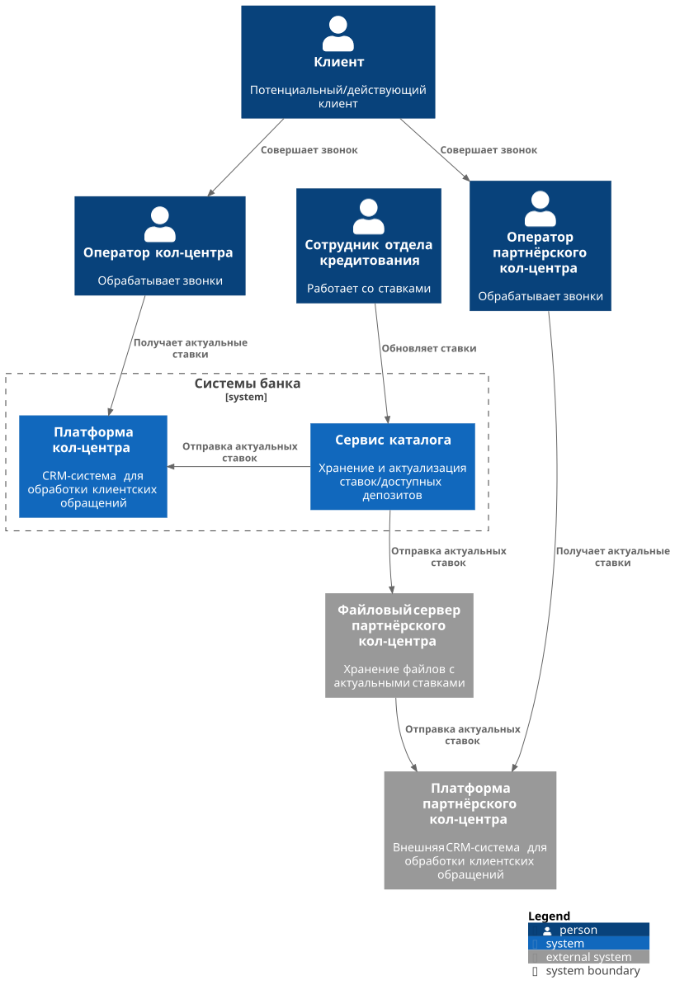

### **Название задачи: 001. MVP открытия депозитов в банке "Стандарт".**
### **Автор: github.com/santechniqueue**
### **Дата: 03.11.2025**

### **Функциональные требования**

| **№** | **Действующие лица или системы** | **Use Case**                                          | **Описание**                                                                                                                                                          |
|:-----:|:---------------------------------|:------------------------------------------------------|:----------------------------------------------------------------------------------------------------------------------------------------------------------------------|
|  F1   | Оператор кол-центра              | Просматривать актуальные ставки в CRM                 | Сотрудник кол-центра должен иметь возможность просмотра актуальных ставок в CRM.                                                                                      |
|  F2   | Оператор партнёрского кол-центра | Просматривать актуальные ставки банка в своей системе | Сотрудник партнерского кол-центра так же должен иметь возможность просмотра актуальных ставок в своей системе.                                                        |  
|  F3   | Система                          | Автоматически обновлять ставки в системе              | Система должна автоматически высчитывать и обновлять ставку на основе ставки рефинансирования ЦентробанкаЮ текущего количество выданных кредитов и депозитов в банке. |
|  F4   | Система                          | Экспорт ставок после обновления                       | Распространять актуальные ставки для всех систем.                                                                                                                     |
|  F5   | Сотрудник отдела кредитования    | Вручную обновлять ставки в системе                    | Сотрудник отдела кредитования так же должен иметь возможность обновлять ставки в системе (вместо XLS файла, как сейчас) в экстренном случае.                          |
|  F6   | Система                          | Импорт ставок в CRM                                   | После обновления ставок - считывать информацию о новых ставках и загружать их в CRM.                                                                                  |
|  F7   | Система                          | Импорт ставок в партнерскую систему кол-центра        | После обновления ставок - считывать информацию о новых ставках и отправлять их файлом партнерскому кол-центру.                                                        |

### **Нефункциональные требования**

| **№** | **Требование**                                                                                                                    |
|:-----:|:----------------------------------------------------------------------------------------------------------------------------------|
|  NF1  | Мгновенная актуализация ставок во внутреннем кол-центр - задержка <= 1 сек с момента обновления ставок.                           |
|  NF2  | Мгновенная отправка ставок партнерскому кол-центру - задержка <= 1 сек с момента обновления ставок.                               |
|  NF3  | Формат файлов: CSV, UTF‑8, разделитель.                                                                                           |
|  NF4  | Обмен файлами с партнёрским КЦ - по SFTP протоколу.                                                                               |
|  NF5  | Ретрай отправки, протоколирование всех операций.                                                                                  |
|  NF6  | Совместимость со стеком MVP: Catalog (Python + MS SQL + KeyDB), Integrations (Kong).                                              |
|  NF7  | Горизонтальное масштабирование, импорт в КЦ проводится пакетами, rate‑limit на Catalog API.                                       |

### **Решение**

[Диаграмма контекста](C4_Context.puml)

