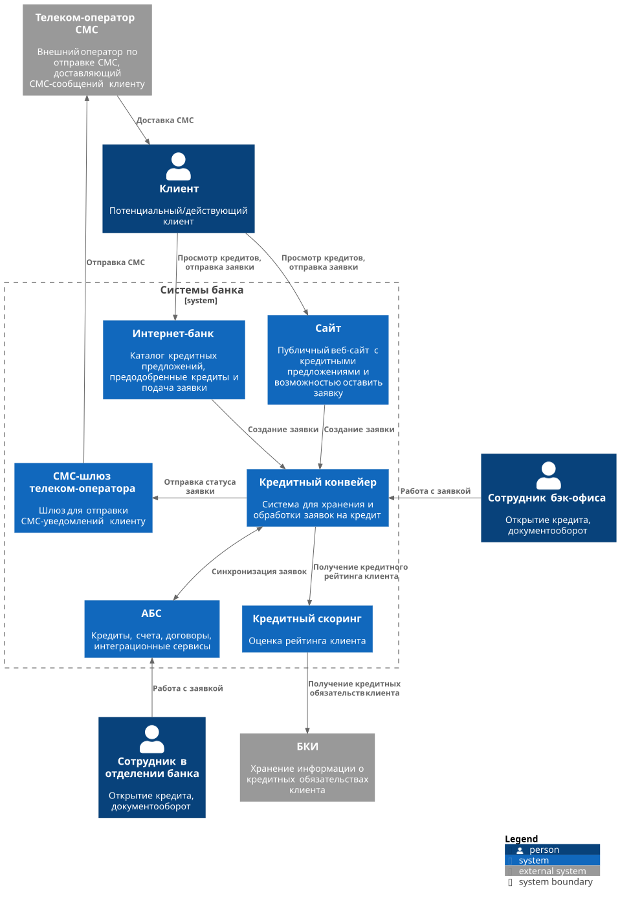
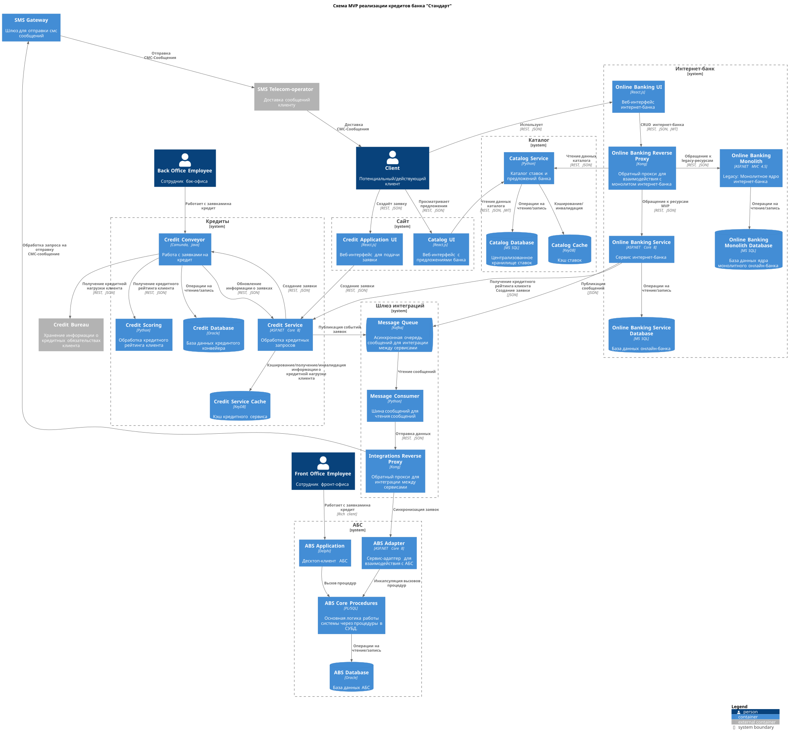

### **Название задачи: 002. Открытие кредитов в банке "Стандарт".**
### **Автор: github.com/santechniqueue**
### **Дата: 05.11.2025**

### **Функциональные требования**

| **№** | **Действующие лица или системы**                        | **Use Case**                                                        | **Описание**                                                                                                                                                                                                     |
|:-----:|:--------------------------------------------------------|:--------------------------------------------------------------------|:-----------------------------------------------------------------------------------------------------------------------------------------------------------------------------------------------------------------|
|  F1   | Новый клиент > Сайт                                     | Просматривать актуальные предложения на сайте                       | Новый клиент может просматирвать актуальные кредитные предложения на сайте.                                                                                                                                      |
|  F2   | Новый клиент > Сайт                                     | Подать заявку на кредит с сайта                                     | Новый клиент может подать заявку на открытие кредита с сайта, указав телефон и ФИО.                                                                                                                              |     
|  F3   | Новый клиент > Сайт > Кредитный скоринг                 | Предварительно принимать решение о выдаче кредита                   | Новый клиент оставляет паспортные данные > Кредитный рейтинг сверяется с БКИ > принимается предварительное решение о выдаче кредита                                                                              |
|  F4   | Клиент > Сайт/Интернет-банк                             | Просматривать список доступных кредитов на сайте и в интернет-банке | Клиенту должны отображаться доступные ему кредиты на сайте и в интернет банке                                                                                                                                    |
|  F5   | Интернет-банк > Клиент                                  | Предварительно одобрять и отображать кредитные предложения          | Клиенту должны отображаться предодобренные кредиты в интернет-банке.                                                                                                                                             |
|  F6   | Клиент > Интернет-банк                                  | Подать ускоренную заявку на предодобренный кредит                   | Подача заявки в интернет-банке происходит в ускоренном порядке с СМС‑подтверждением.                                                                                                                             |
|  F7   | Клиент > Сайт/Интернет-банк > Сотрудник отделения > АБС | Поддерживать единый контур заявок на кредит                         | Клиент может оформить заявку на кредит в отделении банка, но эта же заявка может быть создана им и на сайте/в интернет-банке. В таком случае, сотрудник банка должен продолжить работать с той же самой заявкой. |

### **Нефункциональные требования**

| **№** | **Требование**                                                                                                                                                                                                                         |
|:-----:|:---------------------------------------------------------------------------------------------------------------------------------------------------------------------------------------------------------------------------------------|
|  NF1  | Доступность 24/7 SLA 99,9% для нового контура, резервирование между ЦОД, авто-фейловер.                                                                                                                                                |
|  NF2  | Горизонтальное масштабирование API/воркеров; rate‑limit на внешние интеграции.                                                                                                                                                         |
|  NF3  | БД для кредитных систем - MS SQL                                                                                                                                                                                                       |
|  NF4  | Безопасность ПДн: Передача данных должна происходить с использованием TLS 1.2+, шифрования, маскирования логов, хранение данных на территории РФ.                                                                                      |
|  NF5  | Совместимость с текущим стеком: Интернет-банк - .NET Framework 4.5/ASP.NET Core 8; Депозиты - ASP.NET Core 8 + PostgreSQL + Patroni + HA; Catalog - Python + MS SQL + KeyDB; Integrations - Kong + Python, через внешние сервисы/шлюз. |
|  NF6  | Идемпотентность и retry для БКИ.                                                                                                                                                                                                       |

### **Решение**

[Диаграмма контекста](C4_Context.puml)

[Диаграмма контейнеров](C4_Containers.puml)

